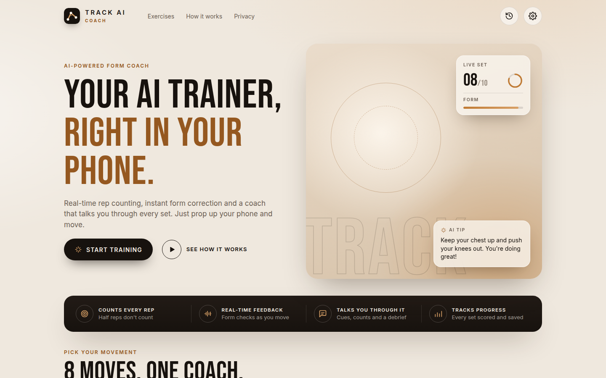
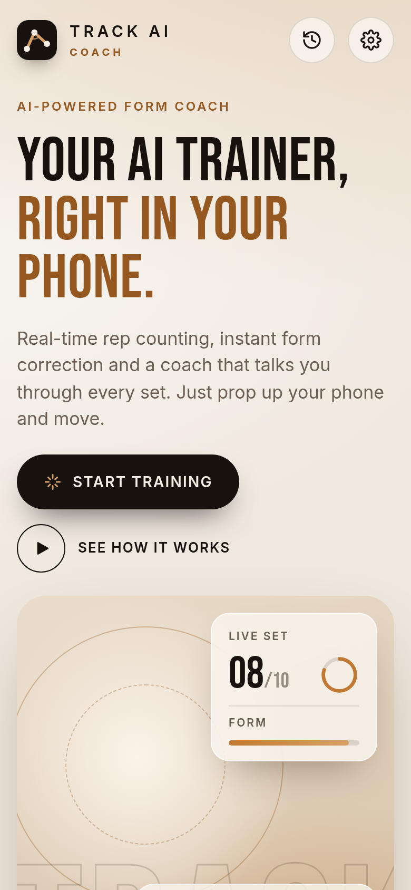
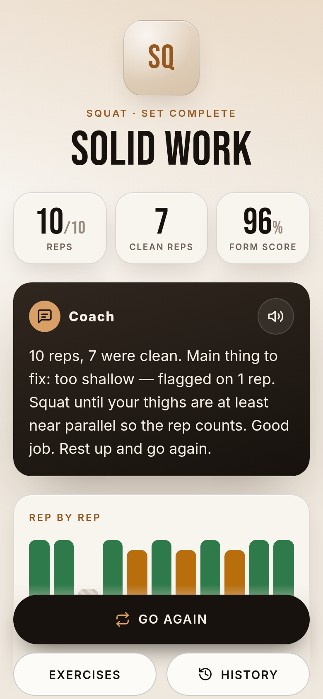

# TRACK AI Coach

**An AI personal trainer that lives in your phone's browser.** Prop your phone up, start a set and train:
the camera tracks your body in real time, the coach counts every rep, spots bad form the moment it
happens ("knees caving in", "back rounding", "hips sagging") and **talks to you** mid-set: what you're
doing right, what's wrong and how to fix it. After the set you get a spoken debrief and a rep-by-rep
breakdown.

<p align="center">
  
</p>
<p align="center">
  
  
</p>

- **Real-time body tracking on the device** with MediaPipe Pose (33 landmarks). No video ever leaves the
  phone; a Content-Security-Policy even blocks MediaPipe's own usage-metrics beacon.
- **Rep counting** that rejects half reps ("that one didn't count — go deeper"), catches reps that never
  lock out and works with the phone side-on, facing you or at an angle.
- **Form checks** per exercise, highlighted on your skeleton in red and spoken as short, actionable cues.
- **A voice coach** that sounds like a real one: counts reps, corrects faults without nagging, notices
  when you fix them ("Better!"), calls milestones ("Two more!", "Last one!"), guides you into position
  and counts down planks.
- **AI debrief with Claude** (optional): after the set, the server turns your numbers into two or three
  spoken sentences of coaching. Without an API key the app uses its on-device summary.
- **Free, supported by ads** (Google AdSense), with a real website around the app: step-by-step form
  guides for every exercise, training articles, about, privacy policy and terms pages
  ([set up ads](#ads-google-adsense)).
- **Works offline**: the whole app is saved on the first visit (the body-tracking model the first time
  you start a set), keeps the screen awake during a set, history of your sets. A warm, editorial look:
  cream and espresso with bronze accents, Bebas Neue headlines and Inter text (both bundled, SIL Open
  Font License, see `src/assets/fonts`).
- **AI people, not stick figures**: exercise photos and camera-free demo videos of photorealistic
  **AI-generated people who don't exist**. The demo runs the real tracking on the video, exactly like
  a camera feed, and the app labels them as AI-generated ([how to create them](#ai-people)).

## Exercises and what the coach checks

| Exercise | Best camera view | Form checks |
| --- | --- | --- |
| Squat | side-on (depth, back) or facing (knees) | too shallow / above parallel, **knees caving in**, **back rounding**, chest dropping, heels lifting, shifting to one side, dropping too fast, not standing tall |
| Push-up | side-on | **hips sagging**, hips too high, head dropping, too shallow, not locking out, dropping too fast |
| Lunge | side-on or facing | too shallow, leaning forward, front knee caving in, rushing |
| Romanian deadlift | side-on | **back rounding**, squatting it (knees too bent), hips not going back, short range, not finishing tall, lowering too fast |
| Bicep curl | facing | half reps, not extending fully, swinging, elbows drifting, dropping the weight (simultaneous or alternating arms) |
| Shoulder press | facing (arms) or side-on (lean) | partial press, soft lockout, leaning back, uneven arms |
| Jumping jacks | facing | hands not overhead, feet not wide |
| Plank (timed) | side-on | hips sagging, hips too high, head dropping — the timer pauses when you drop out |

## Quick start

Requires Node.js 20.19+.

```bash
npm install
npm run fetch-models     # optional: bundle the pose models for offline use (else they load from Google's CDN)
npm run dev              # http://localhost:5173 — works with a laptop webcam
```

Open the app, pick an exercise and **Start set**. Once [AI demo videos](#ai-people) are added, a
**Watch a demo** button (no camera needed) appears too; `http://localhost:5173/?demo=squat` jumps
straight to one.

The dev server proxies `/api` to `localhost:8787`; to try AI debriefs while developing, run
`ANTHROPIC_API_KEY=sk-ant-... npm run dev:server` in a second terminal.

### On your phone

Browsers only give camera access on secure origins, so a phone on your Wi-Fi needs HTTPS:

```bash
npm run dev:https        # self-signed HTTPS on your LAN, e.g. https://192.168.1.20:5173
```

Accept the certificate warning on the phone, prop it up 2–3 m away, turn the volume up and go. For
day-to-day use, deploy it (below).

## AI people

The exercise photos and the camera-free demo show photorealistic **AI-generated people who don't
exist**, not stick figures. They're made with Google's Imagen (photos) and Veo (short clips) through the
Gemini API:

```bash
npm run people                                       # shows the plan and estimated cost; spends nothing
GEMINI_API_KEY=... npm run people -- --yes           # 8 photos + 8 demo videos (about $10)
GEMINI_API_KEY=... npm run people -- --yes --photos  # photos only (a few cents each)
```

You need a Gemini API key from Google AI Studio (Veo needs billing enabled) and ffmpeg. The script
writes web-ready files to `src/assets/people` and `src/assets/demo`, plus `src/assets/ai-people.json`
with the model and prompt behind each file. Demo videos play forwards then backwards so they loop
without a jump the tracker would notice, and come as H.264 and VP9 so every browser can play one.
Made them with another tool? `npm run people -- --import squat clip.mp4`.

The demo runs the video through the same MediaPipe tracking as the camera, so it shows exactly what the
coach does with you, and the app labels the people as AI-generated. Until the files exist, the cards
show a plain tile and the demo button is hidden.

## Put it online (Vercel)

Import the repository at vercel.com (**Add New → Project**) and click **Deploy**.
[`vercel.json`](vercel.json) already holds the settings (Vite, `dist`, the pose models bundled, clean
page addresses like `/privacy`, unknown addresses open the app, security headers), and every push
redeploys. The site gets HTTPS, so the camera works.

Vercel only hosts files, so that build turns the AI debrief off (`VITE_AI_DEBRIEF=off`) and every set
gets the on-device summary. For AI debriefs, run the server below and point the site at it with
`VITE_COACH_API_URL` instead.

## The website pages

`npm run build` also writes plain HTML pages next to the app (from [`src/site`](src/site)), so they load
instantly and search engines and AdSense's reviewers can read them without running the app:

- `/guides` and a form guide per exercise (`/guides/squat`, …): steps, the mistakes the coach checks
  (taken from its own rules), sets and reps, easier and harder versions, safety, related articles and
  a button that opens the coach on that exercise
- `/articles` and fourteen training articles (`/articles/warm-up`, …): a beginner workout, warming
  up, sets and reps, progressing at home, rest and recovery, a fix for the most common fault in each
  exercise, setting up the phone and how the tracking works. They're in
  [`src/site/articles.ts`](src/site/articles.ts); add one there and it gets its page, a place in the
  sitemap and links from the index and the related guides
- `/about`, `/privacy` (camera, local storage, Google's advertising cookies and opt-outs), `/terms`
  (health notice, no warranty) and `/contact` (only when `VITE_CONTACT_EMAIL` is set)
- `/robots.txt`, `/sitemap.xml` (with a known address) and `/ads.txt` (with AdSense)

With a known address every page also gets a canonical link, a share picture
([`public/og-image.png`](public/og-image.png), redrawn by `node scripts/make-og-image.mjs`) and, on
articles and guides, structured data for search engines. The privacy policy and terms are a solid
starting point, not legal advice: read them and adapt them to you. The home page links to all of them;
the dev server serves them too.

## Ads (Google AdSense)

The app is free and earns from display ads. Nothing shows until you add your AdSense details to
[`.env.production`](.env.production). It's committed on purpose, because everything in it is public
anyway (it ends up in the page source); never put keys or passwords there. A value set in Vercel's
environment variables overrides the file.

| Variable | Example | Purpose |
| --- | --- | --- |
| `VITE_ADSENSE_CLIENT` | `ca-pub-1234567890123456` | Your publisher id: adds AdSense's code to every page, `/ads.txt` and the site-ownership tag |
| `VITE_ADSENSE_SLOT` | `9876543210` | A responsive display ad unit, shown on the home page, after a set, in History and on the website pages |
| `GOOGLE_SITE_VERIFICATION` | `abc123XYZ-_…` | Google Search Console's HTML tag code, to prove the site is yours |
| `SITE_URL` | `https://trackai.fit` | The site's address, for the sitemap and canonical links (on Vercel the production address is used when unset) |
| `VITE_CONTACT_EMAIL` | `hello@trackai.fit` | Adds the contact page (AdSense's reviewers look for one) |

Getting approved, step by step:

1. Connect your own domain in Vercel (**Settings → Domains**). The sitemap and canonical links follow it.
2. Sign up at [adsense.google.com](https://adsense.google.com) with that domain. Put the publisher id in
   `.env.production` as `VITE_ADSENSE_CLIENT` and push; Vercel redeploys with AdSense's code,
   `/ads.txt` and the ownership tag.
3. In AdSense, open **Sites**, click **Verify** and then **Request review**. Reviews take days to a few
   weeks.
4. Publish a consent message for Europe (**Privacy & messaging → European regulations**).
5. Create one display ad unit (**Ads → By ad unit → Display ads**, responsive) and put its id in
   `VITE_ADSENSE_SLOT`. Until then the ad spaces stay hidden.
6. Add the site to [Google Search Console](https://search.google.com/search-console) (HTML tag
   method, code in `GOOGLE_SITE_VERIFICATION`) and submit `/sitemap.xml`.

Ads never appear on the workout screen or on empty pages. Leave AdSense's **Auto ads** off (or at least
its anchor and vignette formats): they could cover the workout screen, and they insert ads into the
app's own screens. AdSense needs a site on your own domain (not `*.vercel.app`), because `ads.txt` must
sit at the domain's root. With ads on, the Content-Security-Policy also allows Google's ad servers; the
AdSense consent message (set up in AdSense under **Privacy & messaging**) covers visitors in Europe.

## Production: app + AI debrief server

```bash
npm run build
ANTHROPIC_API_KEY=sk-ant-... npm start     # serves the app and /api on http://localhost:8787
```

or with Docker:

```bash
docker build -t track-ai .
docker run -p 8787:8787 -e ANTHROPIC_API_KEY=sk-ant-... track-ai
```

Put it behind any HTTPS host (Fly.io, Render, Railway, Cloud Run, a VPS with Caddy…). The frontend is
fully static, so you can also host `dist/` anywhere (GitHub Pages, Netlify) and point it at a separate
API with `VITE_COACH_API_URL` + `ALLOWED_ORIGINS` (see [`.env.example`](.env.example)).

| Variable | Default | Purpose |
| --- | --- | --- |
| `ANTHROPIC_API_KEY` | – | Enables AI debriefs (any credential the Anthropic SDK accepts works) |
| `COACH_MODEL` | `claude-opus-5` | Claude model for debriefs |
| `PORT` | `8787` | Server port |
| `ALLOWED_ORIGINS` | – | Origins allowed to call the API cross-origin |
| `DEBRIEFS_PER_MINUTE` | `12` | Per-IP rate limit |
| `VITE_COACH_API_URL` | same origin | (build time) where the frontend finds the API |
| `VITE_AI_DEBRIEF` | on | (build time) `off` hides the AI debrief, for hosting without the server |
| `VITE_ADSENSE_CLIENT`, `VITE_ADSENSE_SLOT`, `GOOGLE_SITE_VERIFICATION`, `SITE_URL`, `VITE_CONTACT_EMAIL` | – | Ads and the website pages (see [Ads](#ads-google-adsense)) |

**What the AI sees:** only the set's numbers (exercise, reps, form score, which faults happened how
often) — never images. The server accepts only known exercise names and fault titles and substitutes its
own coaching tips, so no free text from the client reaches the model. Requests use low effort for
latency, the server-side refusal fallback, a timeout, and fall back to the on-device summary on any
error.

## How it works

```
camera ─▶ MediaPipe Pose Landmarker (WASM, GPU or CPU — whichever is faster on this device)
       ─▶ One Euro smoothing ─▶ view tracker (front / side / angled, facing, near side)
       ─▶ calibration (holds still in the start position: rest angles, limb lengths, "up")
       ─▶ rep counter (hysteresis state machine: partial reps, lockout, chained reps, tempo)
       ─▶ form rules (per exercise, gated by camera view and rep phase, must persist 200–600 ms)
       ─▶ coach (priority speech queue: counts > corrections > guidance > chatter, with cooldowns)
       ─▶ HUD + skeleton overlay ─▶ set summary ─▶ optional Claude debrief
```

A few design decisions worth knowing:

- **Measure in the plane the movement happens in.** Joint angles are exact in the image when the
  motion is parallel to the camera (squat depth side-on, arm raises facing you). MediaPipe's 3D
  landmarks are a fallback only: against real output they were off by ~20° in depth.
- **Depth-free angles.** Facing the camera, squat and lunge depth use the thigh's vertical extent
  divided by its length measured while standing tall; curls use the forearm the same way. No depth
  estimate needed ([`src/core/segments.ts`](src/core/segments.ts)).
- **Relative, not absolute.** Lean checks compare against your own calibrated posture, and the start of
  each rep against your own resting angle.
- **Back rounding** can't be seen directly (MediaPipe has no spine points), so it's inferred from the
  head dropping off the line of the torso and the shoulder–hip distance shrinking, side-on only.

## Development

```bash
npm test                 # 169 unit tests: engine, exercises, coach, demo, media, server
npm run test:e2e         # Playwright: demo set end-to-end, HUD layout on small/landscape phones,
                         # real camera pipeline with a fake webcam
npm run typecheck
```

- **Synthetic athlete.** [`src/sim`](src/sim) builds a 3D skeleton, poses it through each exercise
  with scriptable faults (knee valgus, rounding, sagging…), and projects it through a pinhole camera into
  MediaPipe's landmark format, with noise and 3D depth error. The tests run whole sets through the
  analyzer across views and seeds, and assert exact rep counts, the right faults on the right reps and
  **no false alarms on clean sets**. End-to-end tests use it in place of the demo video (`?sim`); it
  never appears in the app itself.
- **`?debug`** on the workout screen shows live FPS, detection time, delegate, view, rep phase and
  progress — the quickest way to tune thresholds on a real phone.
- Each exercise is a declarative definition in [`src/exercises`](src/exercises): a rep metric with
  start/target values, per-view form rules, calibration baselines and the coach's cues. Adding one is
  mostly writing that file plus a pose in the simulator.

```
src/
  core/       analysis engine: landmarks, geometry, smoothing, view tracking, rep counter, analyzer
  exercises/  exercise definitions (metrics, rules, cues)
  coach/      voice queue, coach logic, phrases, sound effects, summaries, debrief client
  pose/       MediaPipe detector, camera, skeleton drawing, wake lock
  sim/        synthetic athlete for the tests
  media/      AI people: photos and demo videos bundled from src/assets
  ui/         React screens
server/       Node server: static hosting + /api/debrief (Claude)
scripts/      pose model download, AI people generator
e2e/          Playwright tests
```

## Limitations

- It's a single phone camera: joints hidden behind the body are estimated, so use the recommended view
  for the checks you care most about. Thresholds were tuned on the simulator and checked against real
  MediaPipe output; expect to fine-tune them with real athletes (use `?debug`).
- Speech uses your device's built-in voices, so quality varies by phone (iOS "Enhanced" voices and
  Chrome's Google voices sound best — pick one in Settings).
- TRACK AI Coach gives general fitness feedback, not medical advice.
