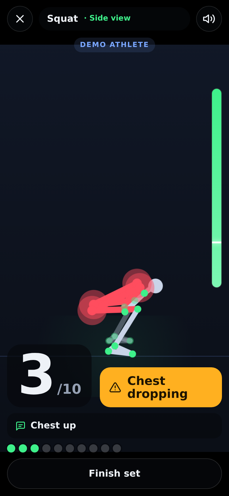

# TRACK AI Coach

**An AI personal trainer that lives in your phone's browser.** Prop your phone up, start a set and train:
the camera tracks your body in real time, the coach counts every rep, spots bad form the moment it
happens ("knees caving in", "back rounding", "hips sagging") and **talks to you** mid-set: what you're
doing right, what's wrong and how to fix it. After the set you get a spoken debrief and a rep-by-rep
breakdown.

<p align="center">
  
  
  
</p>

- **Real-time body tracking on the device** with MediaPipe Pose (33 landmarks). No video ever leaves the
  phone; a Content-Security-Policy even blocks MediaPipe's own usage-metrics beacon.
- **Rep counting** that rejects half reps ("that one didn't count — go deeper"), catches reps that never
  lock out and works with the phone side-on, facing you or at an angle.
- **Form checks** per exercise, highlighted on your skeleton in red and spoken as short, actionable cues.
- **A voice coach** that sounds like a real one: counts reps, corrects faults without nagging, notices
  when you fix them ("Better!"), calls milestones ("Two more!", "Last one!"), guides you into position
  and counts down planks.
- **AI debrief with Claude** (optional): after the set, the server turns your numbers into two or three
  spoken sentences of coaching. Without an API key the app uses its on-device summary.
- **Installable PWA**, works offline once loaded, keeps the screen awake during a set, history of your
  sets, a camera-free **demo athlete** to try everything without moving.

## Exercises and what the coach checks

| Exercise | Best camera view | Form checks |
| --- | --- | --- |
| Squat | side-on (depth, back) or facing (knees) | too shallow / above parallel, **knees caving in**, **back rounding**, chest dropping, heels lifting, shifting to one side, dropping too fast, not standing tall |
| Push-up | side-on | **hips sagging**, hips too high, head dropping, too shallow, not locking out, dropping too fast |
| Lunge | side-on or facing | too shallow, leaning forward, front knee caving in, rushing |
| Romanian deadlift | side-on | **back rounding**, squatting it (knees too bent), hips not going back, short range, not finishing tall, lowering too fast |
| Bicep curl | facing | half reps, not extending fully, swinging, elbows drifting, dropping the weight (simultaneous or alternating arms) |
| Shoulder press | facing (arms) or side-on (lean) | partial press, soft lockout, leaning back, uneven arms |
| Jumping jacks | facing | hands not overhead, feet not wide |
| Plank (timed) | side-on | hips sagging, hips too high, head dropping — the timer pauses when you drop out |

## Quick start

Requires Node.js 20.19+.

```bash
npm install
npm run fetch-models     # optional: bundle the pose models for offline use (else they load from Google's CDN)
npm run dev              # http://localhost:5173 — works with a laptop webcam
```

Open the app, pick an exercise, and either **Start set** (camera) or **Watch a demo** (no camera).
You can also jump straight to a demo with `http://localhost:5173/?demo=squat`.

The dev server proxies `/api` to `localhost:8787`; to try AI debriefs while developing, run
`ANTHROPIC_API_KEY=sk-ant-... npm run dev:server` in a second terminal.

### On your phone

Browsers only give camera access on secure origins, so a phone on your Wi-Fi needs HTTPS:

```bash
npm run dev:https        # self-signed HTTPS on your LAN, e.g. https://192.168.1.20:5173
```

Accept the certificate warning on the phone, prop it up 2–3 m away, turn the volume up and go. For
day-to-day use, deploy it (below) and **Add to Home Screen** — it runs full-screen like a native app.

## Production: app + AI debrief server

```bash
npm run build
ANTHROPIC_API_KEY=sk-ant-... npm start     # serves the app and /api on http://localhost:8787
```

or with Docker:

```bash
docker build -t track-ai .
docker run -p 8787:8787 -e ANTHROPIC_API_KEY=sk-ant-... track-ai
```

Put it behind any HTTPS host (Fly.io, Render, Railway, Cloud Run, a VPS with Caddy…). The frontend is
fully static, so you can also host `dist/` anywhere (GitHub Pages, Netlify) and point it at a separate
API with `VITE_COACH_API_URL` + `ALLOWED_ORIGINS` (see [`.env.example`](.env.example)).

| Variable | Default | Purpose |
| --- | --- | --- |
| `ANTHROPIC_API_KEY` | – | Enables AI debriefs (any credential the Anthropic SDK accepts works) |
| `COACH_MODEL` | `claude-opus-5` | Claude model for debriefs |
| `PORT` | `8787` | Server port |
| `ALLOWED_ORIGINS` | – | Origins allowed to call the API cross-origin |
| `DEBRIEFS_PER_MINUTE` | `12` | Per-IP rate limit |
| `VITE_COACH_API_URL` | same origin | (build time) where the frontend finds the API |

**What the AI sees:** only the set's numbers (exercise, reps, form score, which faults happened how
often) — never images. The server accepts only known exercise names and fault titles and substitutes its
own coaching tips, so no free text from the client reaches the model. Requests use low effort for
latency, the server-side refusal fallback, a timeout, and fall back to the on-device summary on any
error.

## How it works

```
camera ─▶ MediaPipe Pose Landmarker (WASM, GPU or CPU — whichever is faster on this device)
       ─▶ One Euro smoothing ─▶ view tracker (front / side / angled, facing, near side)
       ─▶ calibration (holds still in the start position: rest angles, limb lengths, "up")
       ─▶ rep counter (hysteresis state machine: partial reps, lockout, chained reps, tempo)
       ─▶ form rules (per exercise, gated by camera view and rep phase, must persist 200–600 ms)
       ─▶ coach (priority speech queue: counts > corrections > guidance > chatter, with cooldowns)
       ─▶ HUD + skeleton overlay ─▶ set summary ─▶ optional Claude debrief
```

A few design decisions worth knowing:

- **Measure in the plane the movement happens in.** Joint angles are exact in the image when the
  motion is parallel to the camera (squat depth side-on, arm raises facing you). MediaPipe's 3D
  landmarks are a fallback only: against real output they were off by ~20° in depth.
- **Depth-free angles.** Facing the camera, squat and lunge depth use the thigh's vertical extent
  divided by its length measured while standing tall; curls use the forearm the same way. No depth
  estimate needed ([`src/core/segments.ts`](src/core/segments.ts)).
- **Relative, not absolute.** Lean checks compare against your own calibrated posture, and the start of
  each rep against your own resting angle.
- **Back rounding** can't be seen directly (MediaPipe has no spine points), so it's inferred from the
  head dropping off the line of the torso and the shoulder–hip distance shrinking, side-on only.

## Development

```bash
npm test                 # 154 unit tests: engine, exercises, coach, server
npm run test:e2e         # Playwright: demo set end-to-end + real camera pipeline with a fake webcam
npm run typecheck
```

- **Synthetic athlete.** [`src/sim`](src/sim) builds a 3D skeleton, poses it through each exercise
  with scriptable faults (knee valgus, rounding, sagging…), and projects it through a pinhole camera into
  MediaPipe's landmark format, with noise and 3D depth error. The tests run whole sets through the
  analyzer across views and seeds, and assert exact rep counts, the right faults on the right reps and
  **no false alarms on clean sets**. The same athlete powers the in-app demo.
- **`?debug`** on the workout screen shows live FPS, detection time, delegate, view, rep phase and
  progress — the quickest way to tune thresholds on a real phone.
- Each exercise is a declarative definition in [`src/exercises`](src/exercises): a rep metric with
  start/target values, per-view form rules, calibration baselines and the coach's cues. Adding one is
  mostly writing that file plus a pose in the simulator.

```
src/
  core/       analysis engine: landmarks, geometry, smoothing, view tracking, rep counter, analyzer
  exercises/  exercise definitions (metrics, rules, cues)
  coach/      voice queue, coach logic, phrases, sound effects, summaries, debrief client
  pose/       MediaPipe detector, camera, skeleton drawing, wake lock
  sim/        synthetic athlete for tests and the demo
  ui/         React screens
server/       Node server: static hosting + /api/debrief (Claude)
e2e/          Playwright tests
```

## Limitations

- It's a single phone camera: joints hidden behind the body are estimated, so use the recommended view
  for the checks you care most about. Thresholds were tuned on the simulator and checked against real
  MediaPipe output; expect to fine-tune them with real athletes (use `?debug`).
- Speech uses your device's built-in voices, so quality varies by phone (iOS "Enhanced" voices and
  Chrome's Google voices sound best — pick one in Settings).
- TRACK AI Coach gives general fitness feedback, not medical advice.
